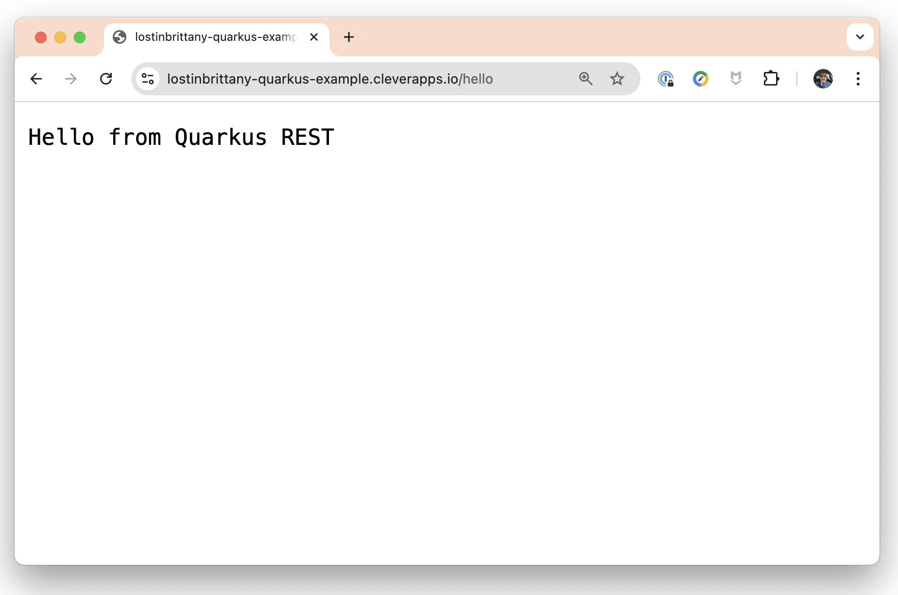

# Quarkus REST Example Application in Clever Cloud
[](https://clever-cloud.com)

This is a simple Quarkus REST application that demonstrates how to build a lightweight Java application with Quarkus and deploy it to Clever Cloud using GraalVM native image compilation.

## About the Application

This application provides a simple REST endpoint:
- `/hello` - Returns a greeting message "Hello from Quarkus REST"

## Technology Stack

- [Quarkus](https://quarkus.io/) - A Kubernetes Native Java framework tailored for GraalVM & OpenJDK HotSpot
- Java 21
- Maven
- GraalVM (for native compilation)

## Prerequisites

- JDK 21+
- Maven 3.8.1+

## Running the Application Locally

### Development Mode

```bash
./mvnw compile quarkus:dev
```

This command starts the application in development mode with live coding enabled. The application will be accessible at http://localhost:8080.

### Production Mode

```bash
./mvnw package
java -jar target/quarkus-example-1.0.0-SNAPSHOT-runner.jar
```

## Deploying on Clever Cloud

You have two options to deploy your Quarkus application on Clever Cloud: using the Web Console or using the Clever Tools CLI.

### Option 1: Deploy using the Web Console

#### 1. Create an account on Clever Cloud

If you don't already have an account, go to the [Clever Cloud console](https://console.clever-cloud.com/) and follow the registration instructions.

#### 2. Set up your application on Clever Cloud

1. Log in to the [Clever Cloud console](https://console.clever-cloud.com/)
2. Click on "Create" and select "An application"
3. Choose "Java + Maven" as the runtime environment
4. Configure your application settings (name, region, etc.)

#### 3. Configure Environment Variables

Add the following environment variables in the Clever Cloud console:

| Variable | Value | Description |
|----------|-------|-------------|
| `CC_JAVA_VERSION` | `21` | Specifies to use Java 21 |
| `CC_RUN_COMMAND` | `java -jar target/quarkus-example-1.0.0-SNAPSHOT.jar` | Specifies the executable to run |

#### 4. Deploy Your Application

You can deploy your application using Git:

```bash
# Add Clever Cloud as a remote repository
git remote add clever git+ssh://git@push-par-clevercloud-customers.services.clever-cloud.com/app_<your-app-id>.git

# Push your code to deploy
git push clever master
```

### Option 2: Deploy using Clever Tools CLI

#### 1. Install Clever Tools

Install the Clever Tools CLI following the [official documentation](https://www.clever-cloud.com/doc/clever-tools/getting_started/):

```bash
# Using npm
npm install -g clever-tools

# Or using Homebrew (macOS)
brew install clever-tools
```

#### 2. Log in to your Clever Cloud account

```bash
clever login
```

#### 3. Create a new application

```bash
# Step 1: Initialize the current directory as a Clever Cloud application
clever create --type maven <YOUR_APP_NAME> 

# Step 2: Add your domain (optional but recommended)
clever domain add <YOUR_DOMAIN_NAME>

# Step 3: Set the required environment variables
clever env set CC_JAVA_VERSION 21
clever env set CC_RUN_COMMAND java -jar target/quarkus-example-1.0.0-SNAPSHOT.jar
```

#### 4. Deploy your application

```bash
clever deploy
```

#### 5. Open your application in a browser

Once deployed, you can access your application at `https://<YOUR_DOMAIN_NAME>/hello`.



### Monitoring Your Application

Once deployed, you can monitor your application through:

- **Web Console**: The Clever Cloud console provides logs, metrics, and other tools to help you manage your application.
- **CLI**: Use `clever logs` to view application logs and `clever status` to check the status of your application.

## Additional Resources

- [Quarkus Guides](https://quarkus.io/guides/)
- [Clever Cloud Documentation](https://www.clever-cloud.com/doc/)
